# Database ER Diagram

This diagram reflects the current live schema that is used to rebuild `employee_management_master.sql`.

```mermaid
erDiagram
    ROLES {
        int id PK
        varchar name
    }

    PERMISSIONS {
        int id PK
        varchar module
        varchar action
    }

    ROLE_PERMISSIONS {
        int id PK
        int role_id FK
        int permission_id FK
    }

    ADMIN_USERS {
        int id PK
        int role_id FK
    }

    ADMIN_USERS_WITH_ROLES {
        int id
        int role_id
    }

    AUDIT_LOGS {
        int id PK
        int admin_id FK
    }

    COMMON_LOOKUPS {
        int id PK
        varchar category
        varchar type_id
    }

    EMPLOYEES {
        int id PK
        int role_id FK
        varchar sso
    }

    EMPLOYEE_ROLES {
        int id PK
        varchar role_name
    }

    ASSETS {
        int id PK
        int assigned_to FK
    }

    POS {
        int id PK
        int project_id FK
    }

    PROJECTS {
        int id PK
        int po_id FK
    }

    PROJECT_TEAMS {
        int id PK
        int project_id FK
    }

    PROJECT_EMPLOYEES {
        int id PK
        int project_id FK
        int team_id FK
        int employee_id FK
    }

    INVOICES {
        int id PK
        int project_id FK
        int team_id FK
    }

    INVOICE_ITEMS {
        int id PK
        int invoice_id FK
        int employee_id FK
    }

    VISA_HISTORY {
        int id PK
        int employee_id FK
    }

    VISA_REMINDERS {
        int id PK
        int employee_id FK
    }

    UPCOMING_VISA_EXPIRATIONS {
        int employee_id
    }

    INCIDENT_TRACKER_INCIDENTS {
        int id PK
        int created_by
        int updated_by
    }

    INCIDENT_TRACKER_COMMENTS {
        int id PK
        int incident_id
        int user_id
    }

    INCIDENT_TRACKER_ATTACHMENTS {
        int id PK
        int incident_id
        int uploaded_by
    }

    INCIDENT_TRACKER_NOTIFICATIONS {
        int id PK
        int user_id
        int incident_id
    }

    INCIDENT_TRACKER_ACTIVITY_LOGS {
        int id PK
        int incident_id
        int user_id
    }

    RELEASE_MANAGEMENT {
        int id PK
        int created_by
        int updated_by
    }

    SPRINT_KPI_SPRINTS {
        int id PK
        int project_id FK
    }

    SPRINT_KPI_STORIES {
        int id PK
        int sprint_id FK
        int project_id FK
    }

    SPRINT_KPI_ENTRIES {
        int id PK
        int story_id FK
        int sprint_id FK
    }

    ROLES ||--o{ ADMIN_USERS : role_id
    ROLES ||--o{ ROLE_PERMISSIONS : role_id
    PERMISSIONS ||--o{ ROLE_PERMISSIONS : permission_id

    ADMIN_USERS ||--o{ AUDIT_LOGS : admin_id
    ROLES ||--o{ EMPLOYEES : role_id
    EMPLOYEES ||--o{ ASSETS : assigned_to

    POS ||--o{ PROJECTS : po_id
    PROJECTS ||--o{ PROJECT_TEAMS : project_id
    PROJECTS ||--o{ PROJECT_EMPLOYEES : project_id
    PROJECT_TEAMS ||--o{ PROJECT_EMPLOYEES : team_id
    EMPLOYEES ||--o{ PROJECT_EMPLOYEES : employee_id

    PROJECTS ||--o{ INVOICES : project_id
    PROJECT_TEAMS ||--o{ INVOICES : team_id
    INVOICES ||--o{ INVOICE_ITEMS : invoice_id
    EMPLOYEES ||--o{ INVOICE_ITEMS : employee_id

    PROJECTS ||--o{ SPRINT_KPI_SPRINTS : project_id
    SPRINT_KPI_SPRINTS ||--o{ SPRINT_KPI_STORIES : sprint_id
    PROJECTS ||--o{ SPRINT_KPI_STORIES : project_id
    SPRINT_KPI_STORIES ||--o{ SPRINT_KPI_ENTRIES : story_id
    SPRINT_KPI_SPRINTS ||--o{ SPRINT_KPI_ENTRIES : sprint_id
```

## Notes

- The diagram shows only relationships that exist as foreign keys in the live schema.
- `incident_tracker_*`, `release_management`, and the view objects do not currently declare foreign keys, so they appear as standalone entities.
- `visa_history` and `visa_reminders` store `employee_id` values and indexes, but the live schema does not declare foreign keys for them.
- `admin_users_with_roles`, `role_permissions_view`, and `upcoming_visa_expirations` are views in the live database. They are included as read-only objects, not as tables.
- The master SQL is now rebuilt from the live database schema, so this diagram should be kept in sync with that script and the migration set.
