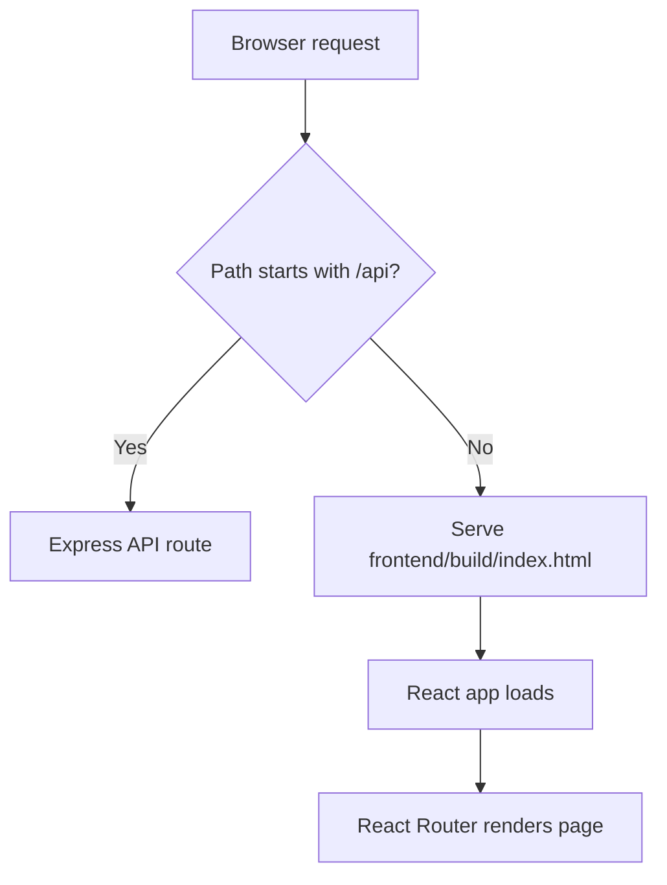

# Local Single-App Deployment Steps

This guide shows how to combine the frontend and backend into one deployable app on your local machine before pushing to Cloud Foundry.

The goal is to produce one runtime bundle where:

- the React frontend is built into `frontend/build`
- the Express backend serves that build
- browser routes like `/admin/dashboard` still work after refresh
- API calls go to the same origin through `/api`

## 1. Confirm the app can run as one process

The backend already supports serving the frontend build when it exists:

- it looks for `frontend/build/index.html`
- it serves the React build as static content
- it returns `index.html` for non-API routes

That logic is already in [backend/server.js](./backend/server.js).

## 2. Set the frontend API base for same-origin requests

Before building the frontend, set the API base to `/api`:

```bash
cd frontend
REACT_APP_API_URL=/api npm run build
```

This is the key step for a single deployment.

It ensures the browser does not call `http://localhost:5010/api` or another hardcoded host. Instead, the app calls the same origin that served the page.

## 3. Verify the frontend build exists

After the build completes, confirm the output folder exists:

```bash
ls frontend/build
```

You should see:

- `index.html`
- `static/`
- other generated assets

## 4. Run the backend against the built frontend

From the backend directory, start the API server:

```bash
cd ../backend
npm start
```

The backend listens on the port from `process.env.PORT` or falls back to `5010`.

For local testing, `5010` is the default.

## 5. Test the combined app locally

Open the following URLs in your browser:

- `http://localhost:5010/`
- `http://localhost:5010/admin/dashboard`
- `http://localhost:5010/employee/login`

Expected behavior:

- `/` loads the React app
- `/admin/dashboard` loads the same React app and React Router renders the dashboard page
- `/employee/login` loads the same React app and shows employee login

## 6. Confirm API routing works

Test backend routes directly through the same origin:

- `http://localhost:5010/api/employees`
- `http://localhost:5010/api/auth`
- `http://localhost:5010/api/projects`

Expected behavior:

- requests beginning with `/api` are handled by Express
- requests without `/api` return the React app shell

## 7. Understand the routing flow



## 8. Create a local release folder

For a real single-app deployment package, create one folder that contains both backend and frontend build output.

A simple shape is:

```text
release/
  backend files
  frontend/
    build/
```

The important part is that `backend/server.js` can resolve `../frontend/build/index.html` from the runtime location.

## 9. Move the frontend build into the backend runtime layout

If you want to test the exact deployment shape locally, place the build where the backend expects it.

One approach is:

```bash
mkdir -p release/frontend
cp -R frontend/build release/frontend/
cp -R backend/* release/
```

Then run the app from `release/`.

If you use this approach, make sure the copied backend still has:

- `server.js`
- `package.json`
- `routes/`
- `controllers/`
- `middleware/`
- `services/`
- `utils/`
- `config/`

## 10. Start the combined release locally

From the release directory:

```bash
npm start
```

If the package scripts are preserved correctly, the app should start the same way it will in PCF.

## 11. Validate direct refresh

After the app is running, refresh a nested route in the browser:

- `/admin/employees`
- `/admin/projects`
- `/employee/dashboard`

Expected behavior:

- the page should not 404
- the React app should reload and render the same screen

This is the main thing that proves the single-app setup is correct.

## 12. Validate authentication

Test both login flows:

- admin login at `/`
- employee login at `/employee/login`

After login, confirm the app redirects into the correct shell and that the protected routes are accessible.

## 13. Validate API-driven screens

Check the major screens that depend on backend data:

- employees
- projects
- assets
- invoices
- PO
- incident tracker
- release management
- sprint KPI

If any of these fail, inspect:

- network requests in the browser
- backend logs
- missing env vars
- incorrect `REACT_APP_API_URL`

## 14. Prepare for PCF later

Once the local single-app version works, the same structure can be pushed to PCF with `cf cli`.

The release artifact should include:

- backend code
- `frontend/build`
- a manifest for the Node app

## 15. Common failure points

### Frontend shows blank page

Usually means:

- `frontend/build` is missing
- the build was created without `REACT_APP_API_URL=/api`
- the backend is not serving static files from the correct path

### API calls fail in the browser

Usually means:

- the frontend was built with the wrong API base URL
- the backend is not running
- the backend route path changed

### Refresh on nested routes returns 404

Usually means:

- the backend is not returning `index.html` for non-API routes
- the frontend build is not in the expected location

## 16. Recommended local verification order

1. Build the frontend with `REACT_APP_API_URL=/api`
2. Start the backend
3. Open `/`
4. Open a nested admin route
5. Open `/employee/login`
6. Refresh each page
7. Check API calls in browser dev tools

## 17. Final result

If all checks pass, you have a valid single-app deployment shape:

- one Node process
- one browser origin
- one API origin
- React and Express running together

That is the same structure you will package for PCF.

