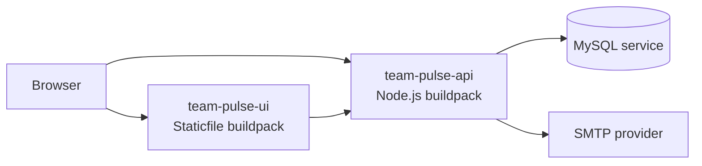

# PCF Deployment Plan

This document defines a production deployment plan for the frontend and backend of the application on Pivotal Cloud Foundry (PCF).

## Goal

Deploy the application as two independently managed PCF apps:

1. `team-pulse-api` for the Node.js backend
2. `team-pulse-ui` for the React frontend

This split gives independent scaling, clearer rollback boundaries, and a clean separation between API runtime and static asset delivery.

The backend can also serve the built frontend from `frontend/build` if you choose a single-app topology later, but the plan below assumes separate apps because that is the safer default for PCF operations.

## Target Architecture



## Why This Layout

- The frontend is a React SPA with no server runtime, so it fits the Staticfile buildpack.
- The backend is an Express app, so it fits the Node.js buildpack.
- The frontend already reads `REACT_APP_API_URL`, so the build can target the PCF API route cleanly.
- The backend already binds to `process.env.PORT`, which is the expected Cloud Foundry contract.

## Application Inputs

### Backend runtime variables

The backend currently uses these environment variables:

- `PORT`
- `JWT_SECRET`
- `DB_HOST`
- `DB_USER`
- `DB_PASSWORD`
- `DB_NAME`
- `DB_PORT`
- `SMTP_HOST`
- `SMTP_PORT`
- `SMTP_SECURE`
- `SMTP_USER`
- `SMTP_PASSWORD`
- `EMAIL_FROM`
- optional logging flags such as `APP_LOG_LEVEL`

### Frontend build variables

The frontend uses:

- `REACT_APP_API_URL`
- optional `REACT_APP_REFRESH_INTERVAL_SECONDS` for the incident tracker dashboard

## Build and Packaging Strategy

### Backend

- Source path: `backend/`
- Buildpack: Node.js buildpack
- Start command: `npm start`
- Runtime port: Cloud Foundry injects `PORT`, and `server.js` already uses it

### Frontend

- Source path: `frontend/`
- Build output: `frontend/build`
- Build command: `npm run build`
- Buildpack: Staticfile buildpack
- SPA routing: enable `pushstate` in a `Staticfile` config

Recommended `Staticfile` content:

```text
root: build
pushstate: enabled
```

## Deployment Order

1. Provision and validate shared services.
2. Deploy the backend API.
3. Smoke test the backend routes.
4. Build the frontend with the production API URL.
5. Deploy the frontend static app.
6. Run end-to-end validation across auth, CRUD, and incident tracker flows.

## Backend Deployment Plan

### 1. Prepare Cloud Foundry space

- Confirm target org and space.
- Confirm route naming convention.
- Confirm buildpack availability in the foundation.
- Confirm the MySQL service plan or user-provided service strategy.

### 2. Database strategy

The backend currently reads database credentials from individual env vars rather than directly from `VCAP_SERVICES`.

Use one of these approaches:

- inject `DB_HOST`, `DB_USER`, `DB_PASSWORD`, `DB_NAME`, and `DB_PORT` through the manifest or pipeline variables
- or add a small adapter later that maps bound service credentials from `VCAP_SERVICES` into the existing config shape

For the first deployment, the simplest path is to inject the values directly and keep the app unchanged.

### 3. Backend manifest

Create `backend/manifest.yml` with a shape like this:

```yaml
applications:
  - name: team-pulse-api
    path: .
    buildpacks:
      - nodejs_buildpack
    command: npm start
    instances: 1
    memory: 512M
    disk_quota: 1G
    routes:
      - route: api-team-pulse.example.com
    env:
      NODE_ENV: production
      JWT_SECRET: ((jwt-secret))
      DB_HOST: ((db-host))
      DB_USER: ((db-user))
      DB_PASSWORD: ((db-password))
      DB_NAME: ((db-name))
      DB_PORT: "3306"
      SMTP_HOST: ((smtp-host))
      SMTP_PORT: "587"
      SMTP_SECURE: "false"
      SMTP_USER: ((smtp-user))
      SMTP_PASSWORD: ((smtp-password))
      EMAIL_FROM: ((email-from))
```

Notes:

- `path` can be set to `backend` if the manifest is placed at repo root.
- Use PCF vars substitution for secrets rather than hardcoding values.
- Keep `PORT` unset in the manifest unless your platform team has a special requirement; Cloud Foundry provides it.

### 4. Backend push sequence

1. `cf target` the correct org and space.
2. `cf push team-pulse-api`.
3. Verify that the route resolves.
4. Hit `GET /` and confirm the API metadata response.
5. Verify auth endpoints and one data endpoint.

### 5. Backend validation checklist

- app starts without crash loops
- database connection succeeds
- JWT login works
- employee list endpoint responds
- incident tracker endpoints respond
- email-related flows work if SMTP is configured

## Frontend Deployment Plan

### 1. Build-time API configuration

The React app reads `REACT_APP_API_URL` at build time.

Set it to the backend route before building:

```bash
REACT_APP_API_URL=https://api-team-pulse.example.com/api npm run build
```

This must happen in CI or in a dedicated release job before the Staticfile push.

### 2. Frontend static app packaging

Create a `Staticfile` file that will be copied into the build output, for example:

```text
root: build
pushstate: enabled
```

This tells PCF to serve the compiled React app and route SPA paths back to `index.html`.

Keep the file in `frontend/public/Staticfile` or copy it into `frontend/build/Staticfile` as part of the release job so the Staticfile buildpack can detect it.

### 3. Frontend manifest

Create `frontend/manifest.yml` with a shape like this:

```yaml
applications:
  - name: team-pulse-ui
    path: build
    buildpacks:
      - staticfile_buildpack
    instances: 1
    memory: 64M
    disk_quota: 256M
    routes:
      - route: team-pulse.example.com
```

Notes:

- `64M` is usually enough for a static React bundle under the Staticfile buildpack.
- If the foundation uses a different static buildpack name, align the manifest with the platform’s installed buildpack identifier.

### 4. Frontend push sequence

1. Run the production build with the backend route baked in.
2. Ensure `build/Staticfile` exists in the packaged artifact.
3. Push the `build` directory as the static app.
4. Confirm the route returns the React shell.
5. Confirm login calls the backend API route correctly.
6. Confirm direct navigation to nested routes works after refresh.

### 5. Frontend validation checklist

- home page loads
- admin login works
- employee login works
- browser refresh on nested routes still loads the SPA
- API requests resolve to the PCF backend route
- toast notifications render

## CI/CD Flow

Recommended pipeline stages:

1. install dependencies
2. run backend unit and integration checks
3. run frontend build
4. package frontend build output
5. deploy backend to a staging space
6. run smoke tests against backend
7. deploy frontend to staging
8. run browser-level validation
9. promote both apps to production

## Release Sequencing

Deploy backend first. The frontend depends on the backend route and API availability.

If the backend route changes, rebuild the frontend so the new `REACT_APP_API_URL` is embedded into the React bundle.

## Rollback Plan

### Backend rollback

- Revert to the previous droplet or previous release version.
- Verify database connectivity and login flow.
- Keep schema migrations backward compatible where possible.

### Frontend rollback

- Re-push the previous build artifact.
- If the backend route changed, keep the prior frontend bundle available until traffic is switched.

## Operational Concerns

### CORS and routing

- Separate frontend and backend routes means CORS must remain enabled on the API.
- If you want to eliminate CORS entirely, use the single-app topology and let the backend serve the built frontend.

### Secrets management

- Do not store `JWT_SECRET`, DB passwords, or SMTP credentials in source control.
- Use PCF variable groups, pipeline secrets, or user-provided services.

### Session and auth behavior

- The frontend stores admin and employee tokens in browser storage.
- Validate logout and 401 handling after deployment because those flows depend on the exact deployment URLs.

### Migrations

- Run SQL migrations before production traffic is switched to the new backend release.
- Treat schema changes as part of the deployment, not as an afterthought.

## Recommended Acceptance Criteria

Deployment is complete when all of the following pass:

- backend responds on its PCF route
- frontend loads on its PCF route
- admin login and employee login succeed
- CRUD operations for employees, projects, assets, invoices, and PO work
- incident tracker routes load in both shells
- direct refresh on a nested frontend route works
- production environment variables are present and no secrets are hardcoded

## Optional Single-App Variant

If you want one route and fewer moving parts, deploy only the backend app and include the frontend build inside it.

This works because `backend/server.js` already serves `frontend/build` when the files exist.

That option is simpler for same-origin auth, but the separate-app layout above is better for operational isolation and independent release cadence.
