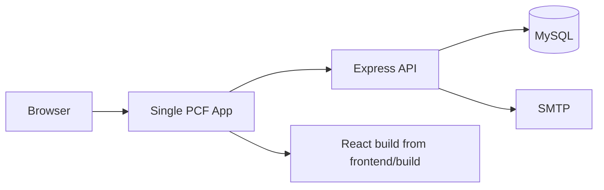

# Single-App PCF Deployment Plan

This document describes how to deploy the frontend and backend together as one Cloud Foundry app using `cf cli`.

## Summary

This repository can be deployed as a single app because the backend already serves the React build when it finds `frontend/build/index.html`, and the frontend already supports a configurable API base URL.

Relevant code paths:

- Backend serves the built frontend when present: [backend/server.js](./backend/server.js)
- Frontend API base URL: [frontend/src/services/api.js](./frontend/src/services/api.js)
- Frontend auth API base URL: [frontend/src/services/authService.js](./frontend/src/services/authService.js)

Cloud Foundry requirements that matter here:

- the Node app must listen on the `PORT` provided by Cloud Foundry
- the pushed artifact must contain the built frontend under `frontend/build`
- the app should be deployed with the Node.js buildpack

Reference docs:

- [Cloud Foundry Node.js buildpack](https://docs.cloudfoundry.org/buildpacks/node/index.html)
- [Cloud Foundry environment variables](https://docs.cloudfoundry.org/devguide/deploy-apps/environment-variable.html?force_isolation=true)
- [Cloud Foundry manifest attributes](https://docs.cloudfoundry.org/devguide/deploy-apps/manifest-attributes.html)

## Target Architecture



## Why Single-App Works Here

The current backend already includes the static asset serving logic:

- `frontend/build` is resolved relative to the backend runtime
- non-API routes fall back to `frontend/build/index.html`
- API routes continue to use `/api/*`

That means one deployed app can:

- serve the React UI
- handle login and CRUD requests
- expose all API endpoints
- keep browser traffic on one origin

## Deployment Requirements

### Frontend build

Build the frontend before pushing the app:

```bash
cd frontend
REACT_APP_API_URL=/api npm run build
```

The important part is `REACT_APP_API_URL=/api`, which keeps the browser on the same origin as the backend.

### Release artifact layout

The deployment artifact must include the backend source and the frontend build in the structure expected by `backend/server.js`:

```text
release/
  server.js
  package.json
  routes/
  controllers/
  middleware/
  services/
  utils/
  config/
  frontend/
    build/
```

If the app is pushed from the `backend/` directory directly, the `frontend/build` folder will not be present where the server expects it. The release bundle must be assembled first.

## Manifest

Create one manifest for the single app, for example:

```yaml
applications:
  - name: team-pulse
    path: .
    buildpacks:
      - nodejs_buildpack
    command: npm start
    instances: 1
    memory: 512M
    disk_quota: 1G
    routes:
      - route: team-pulse.example.com
    env:
      NODE_ENV: production
```

Notes:

- Do not hardcode secrets in source control.
- Keep `PORT` out of the manifest unless your platform team requires it.
- Cloud Foundry injects the runtime port.

## Runtime Variables

The backend currently reads these configuration values:

- `DB_HOST`
- `DB_USER`
- `DB_PASSWORD`
- `DB_NAME`
- `DB_PORT`
- `JWT_SECRET`
- `SMTP_HOST`
- `SMTP_PORT`
- `SMTP_SECURE`
- `SMTP_USER`
- `SMTP_PASSWORD`
- `EMAIL_FROM`

Optional logging-related variables may also be present, such as `APP_LOG_LEVEL`.

## CF CLI Deployment Flow

### 1. Prepare the build

Run the frontend build with the production API base:

```bash
cd frontend
REACT_APP_API_URL=/api npm run build
```

### 2. Assemble the release directory

Copy the backend app and the generated `frontend/build` output into a single release directory.

This is a packaging step, not a CF step. The app needs the combined layout before `cf push`.

### 3. Target the space

```bash
cf target -o <org> -s <space>
```

### 4. Push the app

From the release directory:

```bash
cf push
```

Or, if the manifest is named explicitly:

```bash
cf push team-pulse
```

### 5. Inject environment variables

Provide the database, JWT, and SMTP values using your platform-approved method:

- manifest `env`
- `cf set-env`
- pipeline secrets
- user-provided services

For production, prefer service bindings or secret management over committed values.

## Validation Checklist

Verify the deployment in this order:

1. `GET /` returns the API metadata JSON.
2. The browser loads the frontend shell at `/`.
3. Admin login works.
4. Employee login works.
5. Refreshing a nested route still renders the SPA.
6. API requests resolve successfully from the browser.
7. Database-backed CRUD flows work.
8. Email-related workflows work if SMTP is configured.
9. Incident tracker routes load under the same app.

## Rollback Plan

Rollback is straightforward with a single app:

1. Revert to the previous release artifact.
2. Push the prior build with `cf push`.
3. Confirm login, routes, and database connectivity.

Keep migrations backward compatible where possible so rollback is not blocked by schema drift.

## Tradeoffs

### Advantages

- one route
- no CORS between frontend and backend
- simpler browser auth behavior
- simpler CF CLI operational model

### Costs

- frontend and backend scale together
- every frontend change requires a backend redeploy
- release packaging is more important because the frontend build must be embedded in the backend artifact

## Recommended Use

Use this approach if you want the simplest operational deployment and do not need independent scaling of the UI and API.

Use separate frontend and backend apps if you want looser coupling and independent deployment cadence.

