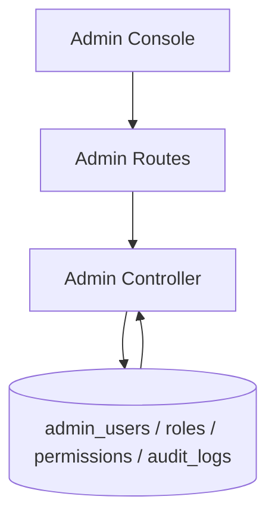

# Admin Flow

## Description

This flow manages admin users, audit logs, and dashboard summary data for privileged users.

## Endpoints

- `GET /api/admin/users`
- `GET /api/admin/users/:id`
- `POST /api/admin/users`
- `PUT /api/admin/users/:id`
- `DELETE /api/admin/users/:id`
- `GET /api/admin/audit-logs`
- `GET /api/admin/dashboard/stats`

## Queries Used

- `SELECT` admin users with role and permission joins
- `INSERT` new admin users
- `UPDATE` admin user profile, status, and password
- `DELETE` admin users by id
- `SELECT` audit logs with filters and search
- `SELECT` dashboard aggregates from the core tables

## Reference SQL

```sql
SELECT au.id, au.username, au.email, au.full_name, au.status, au.role_id,
       r.name AS role_name, r.display_name AS role_display_name,
       au.last_login, au.created_at, au.updated_at
FROM admin_users au
LEFT JOIN roles r ON au.role_id = r.id
ORDER BY au.created_at DESC
LIMIT ? OFFSET ?;

SELECT al.*, au.username, au.full_name
FROM audit_logs al
LEFT JOIN admin_users au ON al.admin_id = au.id
WHERE 1=1
ORDER BY al.created_at DESC
LIMIT ? OFFSET ?;

SELECT
  COUNT(*) AS total_employees,
  SUM(CASE WHEN status = 'Active' THEN 1 ELSE 0 END) AS active_employees
FROM employees;
```



## Notes

- Audit logs support search filtering.
- Admin user management is role-aware and permission gated.
