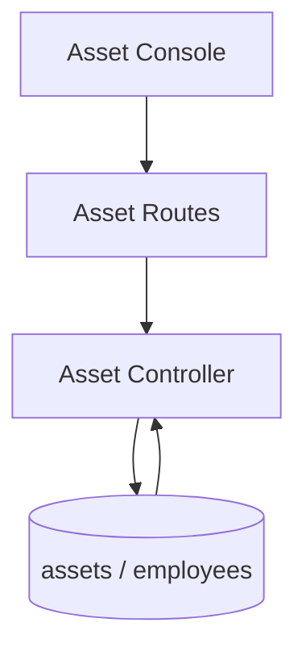

# Asset Flow

## Description

This flow manages asset records and their assignment lifecycle to employees.

## Endpoints

- `GET /api/assets`
- `GET /api/assets/employee/:employee_id`
- `GET /api/assets/:id`
- `POST /api/assets`
- `PUT /api/assets/:id`
- `PUT /api/assets/:id/assign`
- `PUT /api/assets/:id/unassign`
- `DELETE /api/assets/:id`

## Queries Used

- `SELECT` asset inventory and employee assignment data
- `INSERT` assets
- `UPDATE` asset details, assignment, and unassignment state
- `DELETE` assets when no longer tracked
- `JOIN` employees when showing assigned assets

## Reference SQL

```sql
SELECT a.*
FROM assets a
ORDER BY a.created_at DESC;

INSERT INTO assets (asset_type, asset_name, asset_tag, status, assigned_to, created_by, updated_by)
VALUES (?, ?, ?, ?, ?, ?, ?);

UPDATE assets
SET assigned_to = ?, status = ?, updated_by = ?
WHERE id = ?;
```



## Notes

- Assignment state is tracked separately from the asset record itself.
