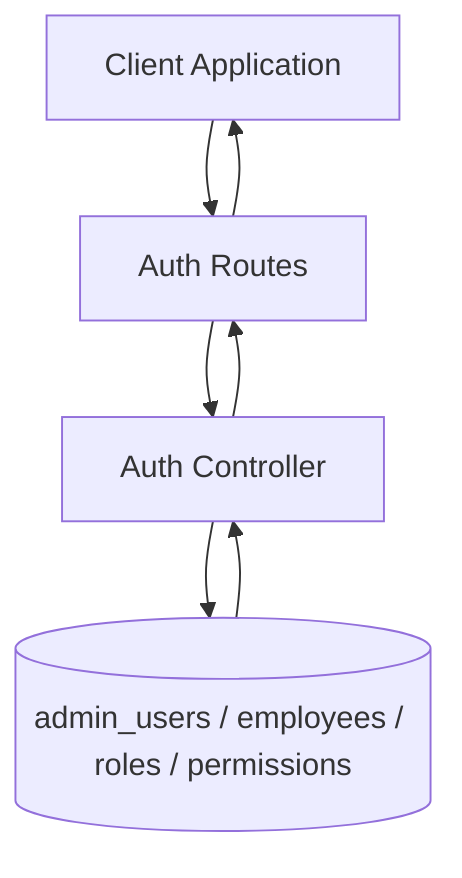

# Auth Flow

## Description

This flow covers authentication for both admin and employee users, including login, profile retrieval, password changes, and logout.

## Endpoints

- `POST /api/auth/login`
- `POST /api/auth/employee-login`
- `GET /api/auth/profile`
- `GET /api/auth/employee-profile-lite`
- `GET /api/auth/employee-profile`
- `POST /api/auth/change-password`
- `POST /api/auth/employee-change-password`
- `POST /api/auth/logout`

## Queries Used

- `SELECT` from `admin_users`, `employees`, `roles`, and `role_permissions`
- `UPDATE employees SET password_hash = ?, must_change_password = 0, last_login = NOW()`
- `UPDATE admin_users SET password_hash = ?`
- `INSERT` audit or session records during login/logout

## Reference SQL

```sql
SELECT au.*, r.id AS role_id, r.name AS role_name, r.display_name AS role_display_name
FROM admin_users au
LEFT JOIN roles r ON au.role_id = r.id
WHERE au.username = ?;

SELECT e.*, r.id AS role_id, r.name AS role_name, r.display_name AS role_display_name,
       e.password_hash, e.must_change_password
FROM employees e
LEFT JOIN roles r ON e.role_id = r.id
WHERE e.sso = ?;

UPDATE employees
SET last_login = CURRENT_TIMESTAMP,
    password_hash = COALESCE(password_hash, ?),
    must_change_password = CASE WHEN password_hash IS NULL THEN 1 ELSE must_change_password END
WHERE id = ?;
```



## Notes

- Admin auth uses `admin_users`.
- Employee auth uses `employees.sso` and `employees.password_hash`.
- Employee profile endpoints return assigned projects and permissions for the logged-in employee.
- Employee runtime permissions are derived from `backend/utils/employeeAccess.js`, not from the admin RBAC tables.
- In the current implementation, all employees receive full Sprint KPI access, and team leads / team members also retain incident and release access through the helper.

## Password to Hash

Use the backend utility to convert a password into a bcrypt hash:

```bash
cd backend
node scripts/passwordTool.js hash 'yourPasswordHere'
```

Example:

```bash
cd backend
node scripts/passwordTool.js hash 'Temp@1234'
```

The repo also includes `backend/scripts/generatePasswordHash.js`, but it is hardcoded to `admin123` and is only useful as a quick example.

Default reset password used by the UI:

- `Temp@1234` for employee password resets
- `admin123` for the default admin account

## Access Notes

If you need to document or test role-based grants in SQL, use the `roles` and `role_permissions` tables for admin RBAC.
For employee login behavior, update `backend/utils/employeeAccess.js` and restart the backend process so the new permissions are returned on login.
