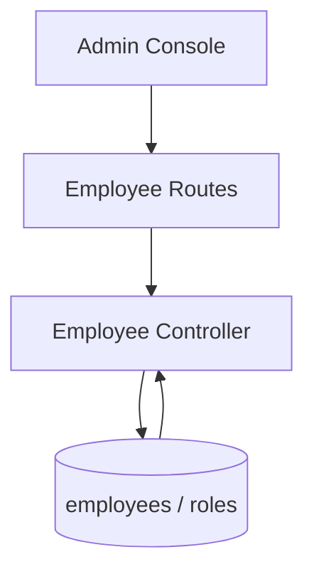

# Employee Flow

## Description

This flow covers employee master data management, including role lookup, bulk import, create, update, and delete operations.

## Endpoints

- `GET /api/employees`
- `GET /api/employees/roles/lookup`
- `POST /api/employees/import`
- `POST /api/employees`
- `GET /api/employees/:id`
- `PUT /api/employees/:id`
- `DELETE /api/employees/:id`

## Queries Used

- `SELECT` employees with role joins
- `SELECT` role lookup data from `roles`
- `INSERT` employees during create and import
- `UPDATE` employees for profile, role, and auth fields
- `DELETE` employees by id

## Reference SQL

```sql
SELECT e.id, e.sso, e.name, e.role_id, r.name AS role_name, r.display_name
FROM employees e
LEFT JOIN roles r ON e.role_id = r.id
WHERE e.sso IS NOT NULL
ORDER BY e.id DESC;

SELECT id, name, display_name
FROM roles
WHERE name IN ('generaluser', 'viewer', 'manager', 'admin', 'super_admin');

UPDATE employees
SET role_id = ?,
    status = ?,
    updated_by = ?
WHERE id = ?;
```



## Notes

- Employees are linked to roles through `employees.role_id`.
- The import path is used for bulk onboarding.
