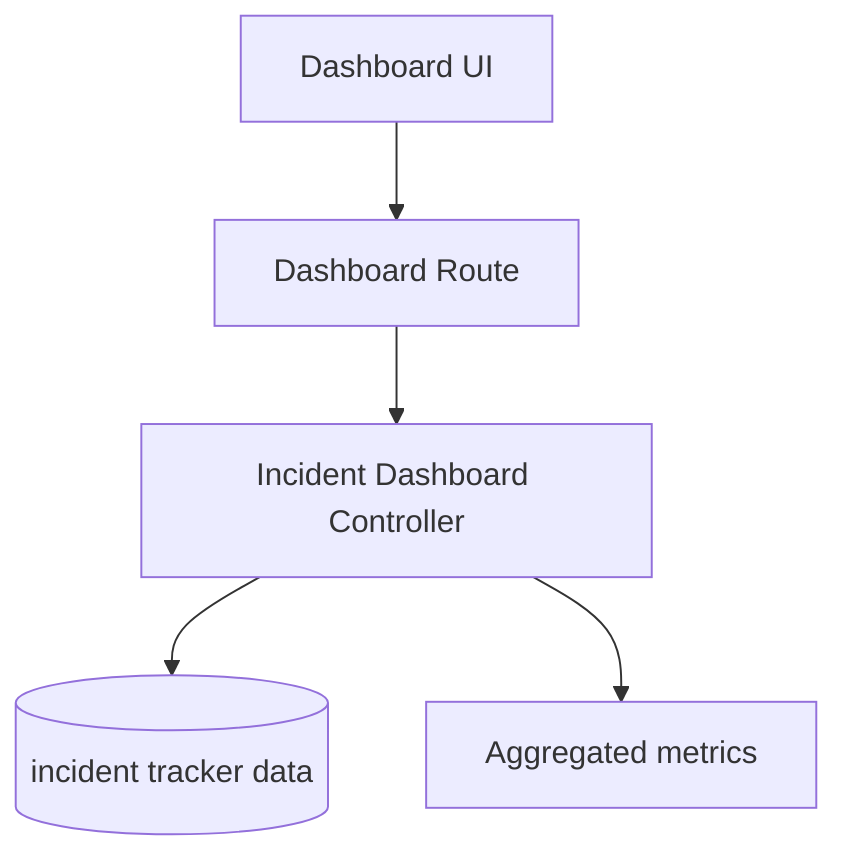

# Incident Dashboard Flow

## Description

This flow produces aggregated incident metrics for dashboard cards, trend charts, and status summaries.

## Endpoints

- `GET /api/dashboard`

## Queries Used

- `SELECT COUNT(*)` style aggregates for incident totals
- `GROUP BY` status, priority, assignee, and date buckets
- `SUM` and `CASE` expressions for summary cards and trend data

## Reference SQL

```sql
SELECT COUNT(*) AS count
FROM incident_tracker_incidents
WHERE incident_month = ? AND status <> ?;

SELECT status, COUNT(*) AS count
FROM incident_tracker_incidents
GROUP BY status
ORDER BY count DESC;

SELECT incident_month AS incidentMonth, COUNT(*) AS count
FROM incident_tracker_incidents
GROUP BY incident_month
ORDER BY incident_month DESC;
```



## Notes

- This is a read-only aggregation flow.
- It should stay fast because it powers the main dashboard view.
