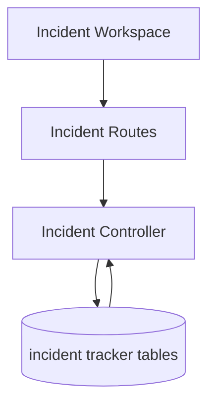

# Incident Flow

## Description

This flow handles incident lifecycle management, including CRUD operations, comments, and file attachments.

## Endpoints

- `GET /api/incidents`
- `GET /api/incidents/reference-data`
- `POST /api/incidents`
- `GET /api/incidents/:id`
- `PUT /api/incidents/:id`
- `DELETE /api/incidents/:id`
- `POST /api/incidents/:id/comments`
- `POST /api/incidents/:id/attachments`

## Queries Used

- `SELECT` incident rows by id and with filters
- `SELECT` incident form lookup data for projects, teams, and employees
- `INSERT` new incidents, comments, and attachments
- `UPDATE` incident status, priority, and details
- `DELETE` incidents when allowed by access rules
- `JOIN` incident tables with related lookup or user data where required

## Reference SQL

```sql
SELECT *
FROM incident_tracker_incidents
WHERE id = ?;

INSERT INTO incident_tracker_incidents (incident_id, change_request_id, incident_date, incident_month, incident_description,
  program_manager, application_agile_team, deployment_type, incident_category, explanation_developer, tech_lead,
  tester, test_lead, resp_member, requirement_gathering, impact_analysis_design, development_unit_testing,
  code_review_test_case_preparation, test_case_review, testing, pre_deployment_verification,
  post_deployment_verification, rca_category, rca_details, action, status, priority, resolution_date,
  sla_target_date, sla_breached, rca_approved_by, rca_approved_at, created_by, updated_by)
VALUES (?, ?, ?, ?, ?, ?, ?, ?, ?, ?, ?, ?, ?, ?, ?, ?, ?, ?, ?, ?, ?, ?, ?, ?, ?, ?, ?, ?, ?, ?, ?, ?, ?, ?);
```



## Notes

- This flow also feeds the incident dashboard and report exports.
