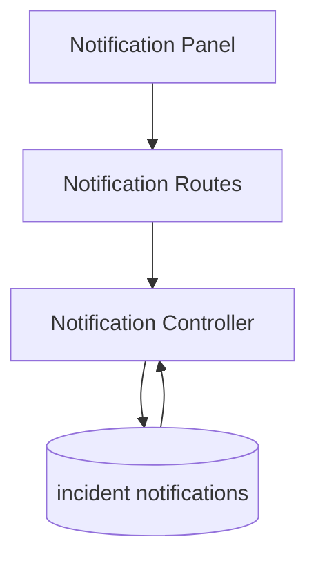

# Incident Notification Flow

## Description

This flow lists incident-related notifications and supports marking individual items as read.

## Endpoints

- `GET /api/notifications`
- `PATCH /api/notifications/:id/read`

## Queries Used

- `SELECT` notifications for the current user or incident context
- `UPDATE` notification read state
- `JOIN` notification records with incidents or users when rendering the list

## Reference SQL

```sql
SELECT id, user_id AS userId, incident_id AS incidentId, title, message, created_at
FROM incident_tracker_notifications
WHERE user_id = ?
ORDER BY created_at DESC;

UPDATE incident_tracker_notifications
SET is_read = TRUE, read_at = NOW()
WHERE id = ?;
```



## Notes

- The read action updates notification state without changing the base incident record.
