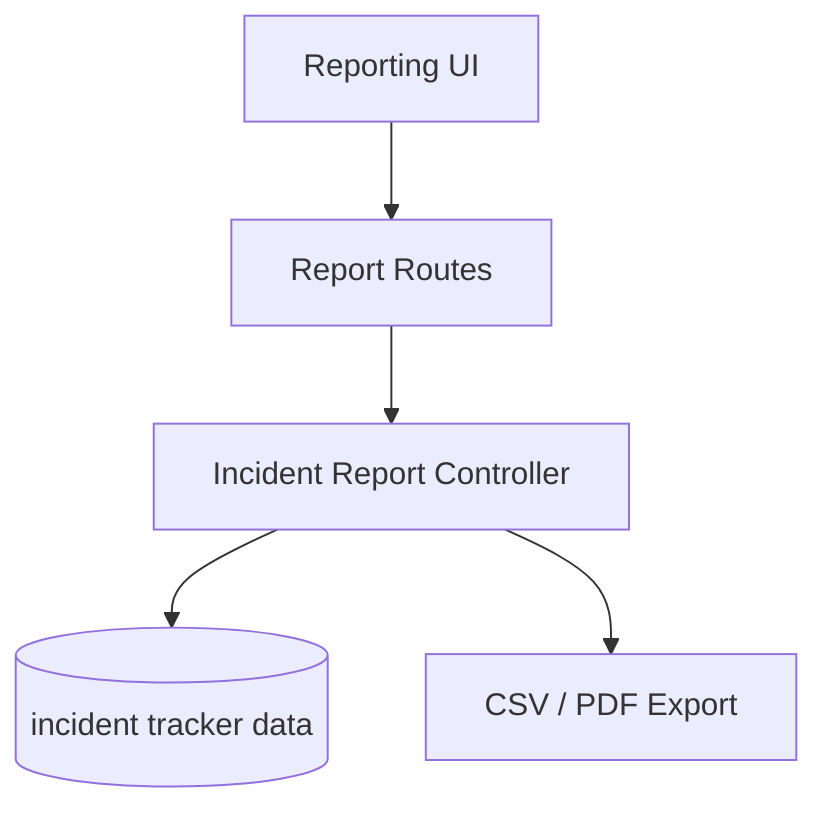

# Incident Report Flow

## Description

This flow exports incident report data into CSV and PDF formats for operational reporting.

## Endpoints

- `GET /api/reports/csv`
- `GET /api/reports/pdf`

## Queries Used

- `SELECT` incident data with filters for export
- `JOIN` related user, project, and status data for reporting
- `GROUP BY` and `ORDER BY` for report layouts
- Export query results into CSV or PDF output

## Reference SQL

```sql
SELECT *
FROM incident_tracker_incidents
WHERE incident_month = ?;

SELECT status, COUNT(*) AS count
FROM incident_tracker_incidents
GROUP BY status
ORDER BY count DESC;
```



## Notes

- This flow is read-only and produces downloadable output.
