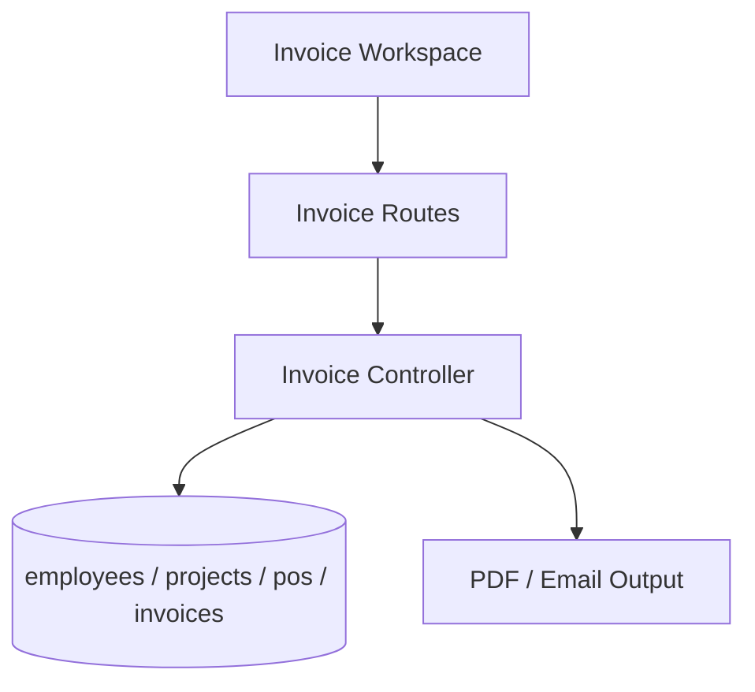

# Invoice Flow

## Description

This flow manages invoice creation, validation, PDF generation, and email delivery.

## Endpoints

- `GET /api/invoices/employees`
- `GET /api/invoices/employees-by-po`
- `GET /api/invoices/check-exists`
- `POST /api/invoices`
- `GET /api/invoices`
- `GET /api/invoices/:id`
- `PUT /api/invoices/:id`
- `DELETE /api/invoices/:id`
- `GET /api/invoices/:id/pdf`
- `POST /api/invoices/:id/send-email`

## Queries Used

- `SELECT` employees, PO data, and existing invoice records
- `INSERT` invoices and invoice line data
- `UPDATE` invoice headers and status
- `DELETE` invoice records when permitted
- `JOIN` invoice data with projects, employees, and PO tables for PDF and email output

## Reference SQL

```sql
SELECT i.*,
       po.po_number,
       po.po_owner_name,
       po.status AS po_status
FROM invoices i
LEFT JOIN pos po ON i.po_id = po.id
ORDER BY i.created_at DESC;

SELECT * FROM invoice_items WHERE invoice_id = ? ORDER BY employee_name;

INSERT INTO invoices (invoice_number, project_id, po_id, status, created_by, updated_by)
VALUES (?, ?, ?, ?, ?, ?);
```



## Notes

- `check-exists` prevents duplicate invoice creation.
- PDF and email actions use the stored invoice data.
