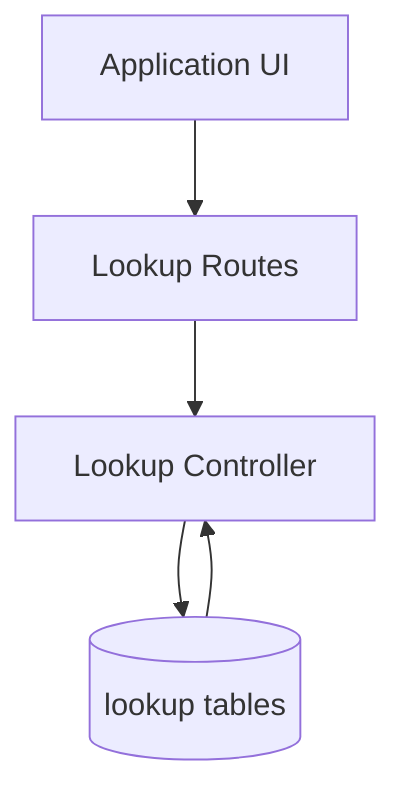

# Lookup Flow

## Description

This flow serves lookup data for dropdowns and reference lists used across the application.

## Endpoints

- `GET /api/lookups/categories`
- `GET /api/lookups/all`
- `GET /api/lookups/category/:category`
- `POST /api/lookups`
- `PUT /api/lookups/:id`
- `DELETE /api/lookups/:id`

## Queries Used

- `SELECT` lookup rows by category and across all categories
- `INSERT` new lookup rows
- `UPDATE` lookup values and metadata
- `DELETE` lookup rows by id

## Reference SQL

```sql
SELECT id, category, type_id, type_name, description, sort_order
FROM common_lookups
WHERE category = ? AND is_active = TRUE
ORDER BY sort_order ASC, type_name ASC;

SELECT DISTINCT category
FROM common_lookups
WHERE is_active = TRUE
ORDER BY category ASC;

INSERT INTO common_lookups (category, type_id, type_name, description, sort_order)
VALUES (?, ?, ?, ?, ?);
```



## Notes

- The category endpoints support dropdowns and grouped data loading.
