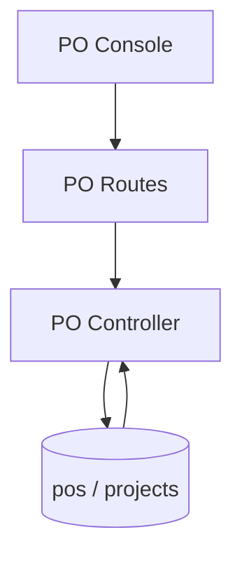

# PO Flow

## Description

This flow manages purchase order records, project-linked lookups, and bulk import.

## Endpoints

- `GET /api/pos`
- `GET /api/pos/project/:project_id`
- `GET /api/pos/:id`
- `POST /api/pos`
- `POST /api/pos/import`
- `PUT /api/pos/:id`
- `DELETE /api/pos/:id`

## Queries Used

- `SELECT` PO records by project and by id
- `INSERT` new PO records and imported rows
- `UPDATE` PO values and linked project data
- `DELETE` PO records
- `JOIN` projects when filtering or displaying linked POs

## Reference SQL

```sql
SELECT p.*
FROM pos p
ORDER BY p.created_at DESC;

SELECT p.*
FROM pos p
WHERE p.project_id = ?;

INSERT INTO pos (project_id, po_number, po_owner_name, status, created_by, updated_by)
VALUES (?, ?, ?, ?, ?, ?);
```



## Notes

- Project-linked PO data is used by invoice creation flows.
