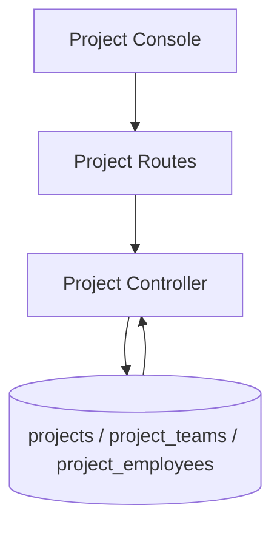

# Project Flow

## Description

This flow manages project records, project imports, employee assignment, and Jira team/board structure.

## Endpoints

- `GET /api/projects`
- `POST /api/projects/import`
- `POST /api/projects`
- `GET /api/projects/:id`
- `PUT /api/projects/:id`
- `PUT /api/projects/:id/employees`
- `DELETE /api/projects/:id`
- `GET /api/projects/teams/all`
- `GET /api/projects/:projectId/teams`
- `POST /api/projects/:projectId/teams`
- `PUT /api/projects/teams/:teamId`
- `DELETE /api/projects/teams/:teamId`
- `GET /api/projects/teams/:teamId/employees`
- `PUT /api/projects/teams/:teamId/employees`
- `DELETE /api/projects/team-employees/:assignmentId`

## Queries Used

- `SELECT` projects, teams, and team employee assignments
- `INSERT` projects, teams, and employee assignments
- `UPDATE` project metadata, team metadata, and assignments
- `DELETE` projects, teams, and assignment rows
- `JOIN` `project_employees` with `projects` and `project_teams` to resolve Jira board names

## Reference SQL

```sql
SELECT p.*,
       COUNT(DISTINCT CASE WHEN ee.status = 'Active' THEN pe.employee_id END) AS employee_count,
       0 AS total_allocation,
       (SELECT COUNT(*) FROM project_teams pt WHERE pt.project_id = p.id) AS team_count,
       po.po_number,
       po.po_owner_name,
       po.status AS po_status
FROM projects p
LEFT JOIN project_employees pe ON p.id = pe.project_id
LEFT JOIN employees ee ON ee.id = pe.employee_id
LEFT JOIN pos po ON p.po_id = po.id
GROUP BY p.id
ORDER BY p.created_at DESC;

SELECT pt.*,
       p.project_team_name
FROM project_teams pt
LEFT JOIN projects p ON pt.project_id = p.id
WHERE pt.project_id = ?
ORDER BY pt.created_at;

SELECT pe.id AS assignment_id, pe.team_id, pe.allocation_percentage,
       e.id, e.sso, e.name, e.role, e.role_type, e.location
FROM project_employees pe
JOIN employees e ON pe.employee_id = e.id
WHERE pe.team_id = ? AND e.status = 'Active'
ORDER BY e.name;
```



## Notes

- Project teams carry the Jira board name used by Sprint KPI and employee assignment views.
