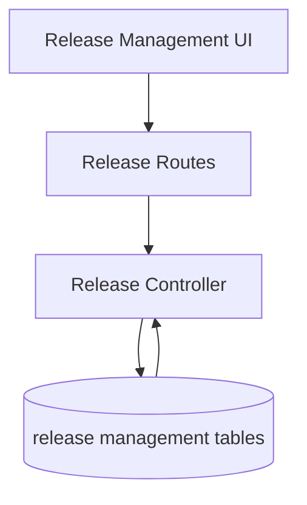

# Release Management Flow

## Description

This flow manages release records and supports the release management screen in the UI.

## Endpoints

- `GET /api/releases`
- `GET /api/releases/:id`
- `POST /api/releases`
- `PUT /api/releases/:id`
- `DELETE /api/releases/:id`

## Queries Used

- `SELECT` release rows with month and status filters
- `INSERT` release records
- `UPDATE` release details and status
- `DELETE` release rows by id

## Reference SQL

```sql
SELECT *
FROM release_management
WHERE 1=1
ORDER BY release_date DESC;

INSERT INTO release_management (project_id, release_name, release_date, status, created_by, updated_by)
VALUES (?, ?, ?, ?, ?, ?);

UPDATE release_management
SET release_name = ?, release_date = ?, status = ?, updated_by = ?
WHERE id = ?;
```



## Notes

- The frontend defaults the month filter to the current month.
