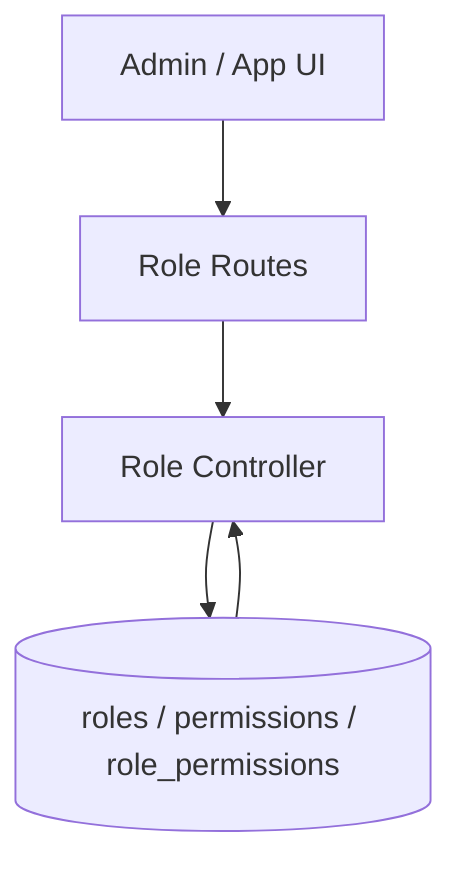

# Role Management Flow

## Description

This flow exposes role and permission administration, plus a self-service permission lookup for the current user.

## Endpoints

- `GET /api/my-permissions`
- `GET /api/roles`
- `GET /api/roles/:id`
- `POST /api/roles`
- `PUT /api/roles/:id`
- `DELETE /api/roles/:id`
- `GET /api/permissions`

## Queries Used

- `SELECT` roles, permissions, and role-permission mappings
- `INSERT` new roles and role-permission rows
- `UPDATE` roles and role metadata
- `DELETE` roles and role-permission rows
- `JOIN` the current user with role and permission tables for `my-permissions`

## Reference SQL

```sql
SELECT p.id, p.module, p.action, p.name, p.description
FROM permissions p
ORDER BY p.module, p.action;

SELECT id, name, display_name, description
FROM roles
WHERE id = ?;

INSERT INTO role_permissions (role_id, permission_id)
VALUES ?;
```



## Notes

- `my-permissions` is the runtime permission source for UI gating.
- For employee logins, runtime access is also influenced by `backend/utils/employeeAccess.js`.
- If you need to grant a DB role full Incident Tracker and Release Management access, use a single `INSERT ... SELECT` against `roles`, `permissions`, and `role_permissions`.

## Example SQL

Grant full Incident Tracker and Release Management access to the `generaluser` role:

```sql
INSERT INTO role_permissions (role_id, permission_id)
SELECT r.id, p.id
FROM roles r
JOIN permissions p
WHERE r.name = 'generaluser'
  AND p.name IN (
    'incident_tracker.view',
    'incident_tracker.create',
    'incident_tracker.update',
    'incident_tracker.delete',
    'incident_tracker.export',
    'release_management.view',
    'release_management.create',
    'release_management.update',
    'release_management.delete',
    'release_management.export'
  )
  AND NOT EXISTS (
    SELECT 1
    FROM role_permissions rp
    WHERE rp.role_id = r.id
      AND rp.permission_id = p.id
  );
```
