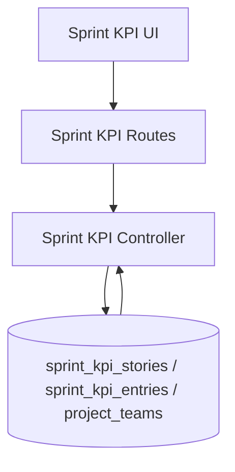

# Sprint KPI Flow

## Description

This flow manages immutable sprint windows, Sprint KPI stories, and child KPI entries, including sprint creation, story attachment, KPI tracking, and employee-specific selection logic.

## Endpoints

- `GET /api/sprint-kpi/stories`
- `GET /api/sprint-kpi/sprints`
- `POST /api/sprint-kpi/sprints`
- `POST /api/sprint-kpi/stories`
- `PUT /api/sprint-kpi/stories/:id`
- `DELETE /api/sprint-kpi/stories/:id`
- `POST /api/sprint-kpi/stories/:storyId/kpis`
- `PUT /api/sprint-kpi/kpis/:id`
- `DELETE /api/sprint-kpi/kpis/:id`

## Queries Used

- `SELECT` sprints, stories, and KPI entries with project and board joins
- `INSERT` Sprint KPI stories and KPI entries
- `UPDATE` story metadata, KPI details, and progress values
- `DELETE` story rows or KPI rows
- `JOIN` `project_employees`, `projects`, and `project_teams` to resolve employee assignments, sprint access, and Jira board names

## Reference SQL

```sql
SELECT sp.id, sp.project_id, sp.agile_board_name, sp.sprint_start_date, sp.sprint_end_date, p.project_team_name
FROM sprint_kpi_sprints sp
LEFT JOIN projects p ON p.id = sp.project_id;

SELECT s.id, s.sprint_id, s.project_id, s.agile_board_name, s.story_id, s.story_name, s.description, s.applicable_kpis, s.created_by, s.updated_by,
       p.project_team_name, sp.sprint_start_date, sp.sprint_end_date
FROM sprint_kpi_stories s
INNER JOIN sprint_kpi_sprints sp ON sp.id = s.sprint_id
LEFT JOIN projects p ON p.id = s.project_id;

INSERT INTO sprint_kpi_sprints (project_id, agile_board_name, sprint_start_date, sprint_end_date, created_by, updated_by)
VALUES (?, ?, ?, ?, ?, ?);

INSERT INTO sprint_kpi_stories (sprint_id, project_id, agile_board_name, story_id, story_name, description, applicable_kpi_category, applicable_kpis, created_by, updated_by)
VALUES (?, ?, ?, ?, ?, ?, ?, ?, ?, ?);

INSERT INTO sprint_kpi_entries (story_id, sprint_id, kpi_category, kpi_subcategory, kpi_option, percentage, comments, agile_board_name, created_by, updated_by)
VALUES (?, ?, ?, ?, ?, ?, ?, ?, ?, ?);
```



## Notes

- Sprint records are immutable after creation in the UI flow.
- Story records carry `sprint_id`, applicable KPI metadata, and `agile_board_name`.
- KPI entries inherit the story sprint and board for filtering and reporting.
- Employee views use assigned projects, Jira board names from `project_teams`, and only show sprint data whose end date is on or before the current date.
