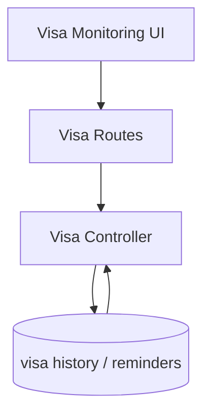

# Visa Flow

## Description

This flow manages visa tracking data, employee lookups, and expiration monitoring.

## Endpoints

- `GET /api/visa/expirations`
- `GET /api/visa/employee/:employeeId`
- `GET /api/visa/:id`
- `POST /api/visa`
- `PUT /api/visa/:id`
- `DELETE /api/visa/:id`

## Queries Used

- `SELECT` visa records by employee and by expiration window
- `INSERT` visa history records
- `UPDATE` visa details and reminder status
- `DELETE` visa entries when removed
- `JOIN` employee data where needed for reporting

## Reference SQL

```sql
SELECT vh.*, a.username AS created_by_name
FROM visa_history vh
LEFT JOIN admin_users a ON vh.created_by = a.id
WHERE vh.employee_id = ?;

INSERT INTO visa_history (employee_id, visa_type, expiry_date, is_current, created_by, updated_by)
VALUES (?, ?, ?, ?, ?, ?);

UPDATE visa_history
SET is_current = FALSE
WHERE employee_id = ?;
```



## Notes

- The expiration endpoint is read-only and supports monitoring views.
