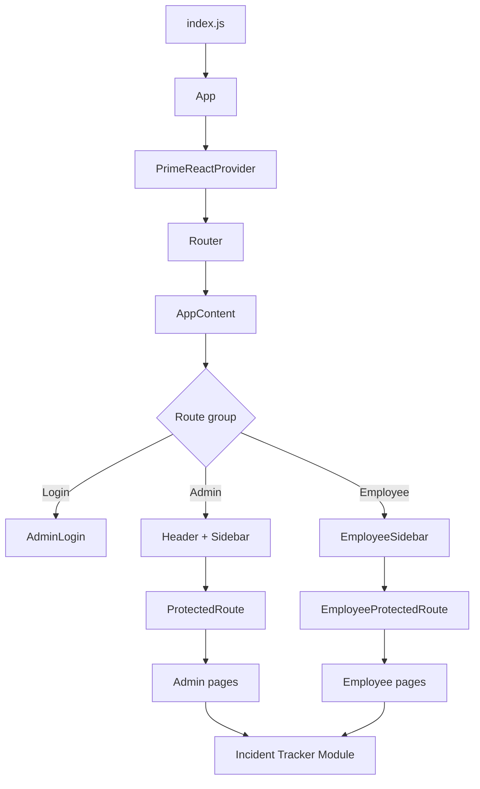

# Application Overview

## Purpose

The frontend is a role-aware React application for employee management, project tracking, asset handling, invoicing, PO workflows, release management, sprint KPIs, and incident tracking.

It supports two main experiences:

- **Admin experience** for operational management and permission-gated access
- **Employee experience** for a reduced set of workflows and self-service actions

## Tech Stack

- React 18
- React Router DOM v6
- Redux Toolkit
- React Redux
- PrimeReact
- PrimeFlex
- PrimeIcons
- Material UI
- Axios
- React Toastify
- Recharts
- XLSX

## Top-Level Structure

The application bootstrap happens in `frontend/src/App.js` and is wrapped with:

- `PrimeReactProvider`
- `BrowserRouter`
- global toast notifications

The app uses conditional layouts based on the current route:

- login routes render without the standard header/sidebar shell
- admin routes render `Header` + `Sidebar`
- employee routes render `EmployeeSidebar`

## Architecture Diagram

## Navigation Model

The router separates the application into three broad areas:

1. public/auth entry points
2. admin routes guarded by permissions
3. employee routes guarded by session-based protection

The incident tracker is mounted as a nested module under both admin and employee route trees.

## Cross-Cutting UI Concerns

- `ToastContainer` provides consistent notifications.
- `ProtectedRoute` enforces permission checks for admin routes.
- `EmployeeProtectedRoute` protects employee-only routes.
- `PermissionGuard` is used where granular UI authorization is needed.
- Shared icons and layout components keep the interaction model consistent across modules.

