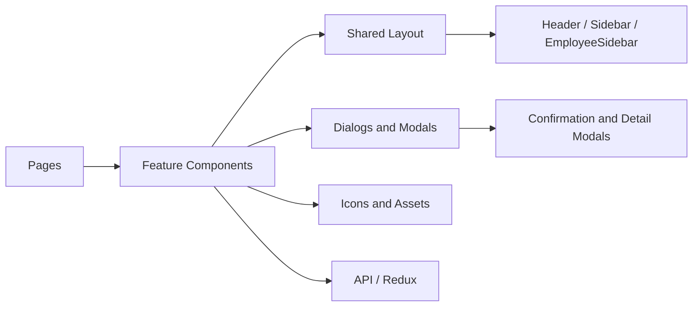

# Components Guide

## Organization

The frontend component tree is grouped by feature and role rather than by generic UI primitives.

### Shared Layout and Auth

- `frontend/src/components/layout/Header.js`
- `frontend/src/components/layout/Sidebar.js`
- `frontend/src/components/layout/EmployeeSidebar.js`
- `frontend/src/components/auth/ProtectedRoute.js`
- `frontend/src/components/auth/EmployeeProtectedRoute.js`
- `frontend/src/components/auth/PermissionGuard.js`
- `frontend/src/components/auth/Navigation.js`

### Employee Management

- `frontend/src/components/employees/EmployeeForm.js`
- `frontend/src/components/employees/EmployeeList.js`
- `frontend/src/components/employees/EmployeeListPrime.js`
- `frontend/src/components/employees/ImportEmployeesDialog.js`
- `frontend/src/components/employees/VisaHistory.js`
- `frontend/src/components/employees/VisaHistoryPrime.js`

### Project Management

- `frontend/src/components/projects/ProjectForm.js`
- `frontend/src/components/projects/ProjectList.js`
- `frontend/src/components/projects/ProjectListPrime.js`
- `frontend/src/components/projects/EmployeeAssignment.js`
- `frontend/src/components/projects/ImportProjectsTeamsDialog.js`

### Asset Management

- `frontend/src/components/assets/AssetFormPrime.js`
- `frontend/src/components/assets/AssetListPrime.js`

### Invoicing

- `frontend/src/components/invoices/GenerateInvoice.js`
- `frontend/src/components/invoices/EditInvoiceModal.js`
- `frontend/src/components/invoices/ViewInvoiceModal.js`
- `frontend/src/components/invoices/SendInvoiceEmailDialog.js`

### Purchase Orders

- `frontend/src/components/pos/PoFormPrime.js`
- `frontend/src/components/pos/PoListPrime.js`
- `frontend/src/components/pos/PoImportDialog.js`

### Modals and Utilities

- `frontend/src/components/modals/ConfirmationModal.js`
- `frontend/src/components/modals/EmployeeDetailsModal.js`
- `frontend/src/components/modals/AssetsByEmployeeModal.js`
- `frontend/src/components/icons/ActionIcons.js`
- `frontend/src/components/icons/MenuIcons.js`
- `frontend/src/assets/SynchronyLogo.js`

## Component Design Pattern

Most feature components follow a simple pattern:

1. presentational shell
2. local form or table state
3. API interaction through shared services or Redux thunks
4. user feedback through toast notifications and dialogs

## Dependency Diagram

## Notes on Reuse

- PrimeReact is used for consistent data-heavy UI elements.
- Material UI is available where richer controls or icons are needed.
- The `PrimeReact` and `MUI` stacks coexist, so component styling should stay aligned with the surrounding screen instead of forcing a single library everywhere.

