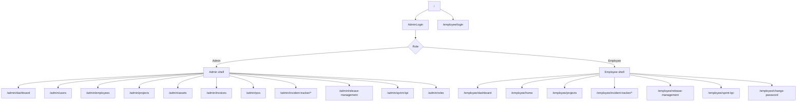

# Pages and Routes

## Route Groups

The application routes are defined in `frontend/src/App.js`.

### Public and Auth Routes

- `/` - admin login entry point
- `/employee/login` - employee login mode

### Admin Routes

- `/admin/dashboard`
- `/admin/users`
- `/admin/employees`
- `/admin/employees/add`
- `/admin/employees/edit/:id`
- `/admin/projects`
- `/admin/assets`
- `/admin/invoices`
- `/admin/pos`
- `/admin/incident-tracker`
- `/admin/incident-tracker/*`
- `/admin/release-management`
- `/admin/sprint-kpi`
- `/admin/roles`

### Employee Routes

- `/employee/dashboard`
- `/employee/incident-tracker/*`
- `/employee/release-management`
- `/employee/sprint-kpi`
- `/employee/projects`
- `/employee/home`
- `/employee/change-password`

## Page Responsibilities

### Admin Pages

- `AdminDashboard` shows administrative summary data and operational metrics.
- `AdminUsersManagement` manages application users and access-related workflows.
- `EmployeesPage`, `AddEmployeePage`, and `EditEmployeePage` cover employee CRUD flows.
- `ProjectsPage`, `AssetsPage`, `InvoicesPage`, and `PosPage` cover their respective operational modules.
- `ReleaseManagementPage`, `SprintKpiPage`, and `RoleManagement` support delivery and access management.
- `IncidentTrackerModule` is embedded as a routed sub-application.

### Employee Pages

- `EmployeeDashboard` provides the employee-facing summary view.
- `EmployeeHome` is the employee landing page after sign-in.
- `EmployeeChangePassword` handles password updates.
- Employee access to projects, release management, sprint KPIs, and incident tracking is constrained by the employee route set.

## Route Flow Diagram

## Route Protection

- `ProtectedRoute` gates admin pages using permissions such as `dashboard.view`, `employees.view`, `projects.view`, and similar scopes.
- Some admin pages accept multiple permissions and allow access when any one is present.
- `EmployeeProtectedRoute` guards employee paths.
- The `/admin/incident-tracker` route redirects to the tracker dashboard, while the nested wildcard route loads the module.
