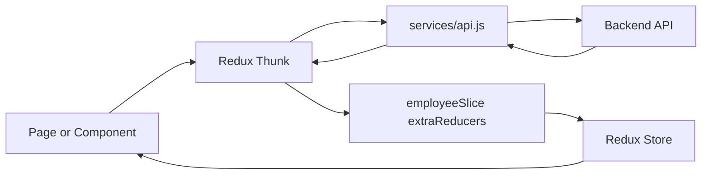

# Redux State Management

## Store Configuration

The Redux store is defined in `frontend/src/redux/store.js`.

Current store shape:

- `employees` managed by `employeeSlice`

The store disables `serializableCheck` in middleware, which is typically done when the application stores or dispatches non-serializable data through async workflows or UI integrations.

## Employee Slice

`frontend/src/redux/employeeSlice.js` provides the centralized employee state.

### State Shape

```js
{
  employees: [],
  selectedEmployee: null,
  loading: false,
  error: null,
  searchTerm: ''
}
```

### Reducers

- `setSearchTerm`
- `clearError`
- `clearSelectedEmployee`

### Async Thunks

- `fetchEmployees`
- `fetchEmployeeById`
- `addEmployee`
- `modifyEmployee`
- `removeEmployee`

These thunks call the shared service functions in `frontend/src/services/api.js`.

## Data Flow



## Employee Search Flow

The slice also provides `selectFilteredEmployees`, which applies client-side filtering against:

- first name
- last name
- email
- department
- position

This keeps the list screens responsive while still allowing a simple global search term.

## Recommended Usage Pattern

Use Redux for employee list state that is shared across screens. Keep narrow form state local to the page or dialog when the data does not need to outlive the current view.

